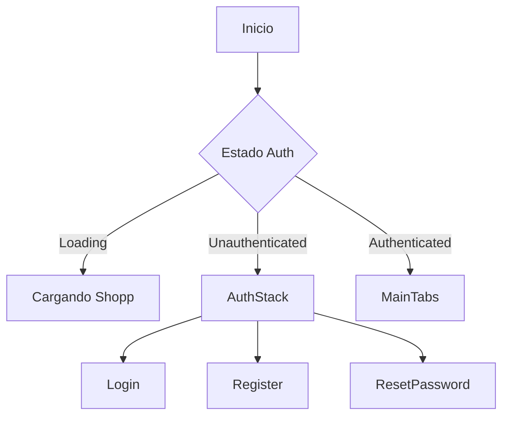
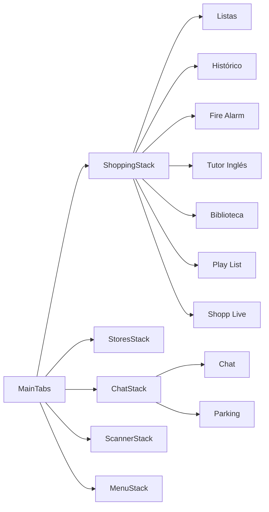
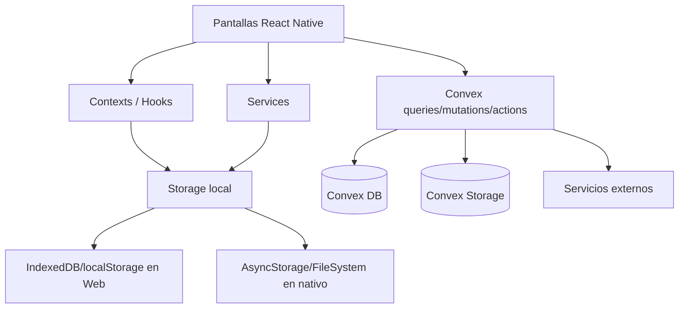
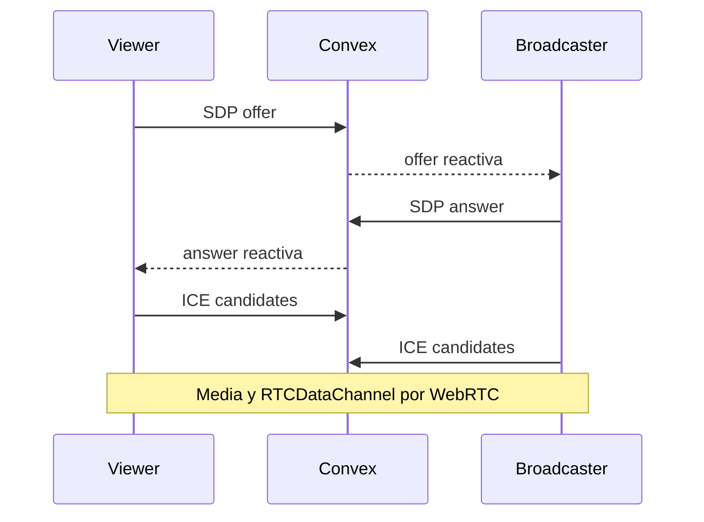
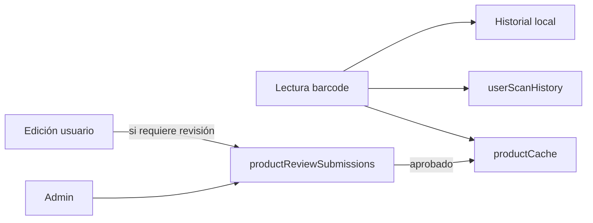
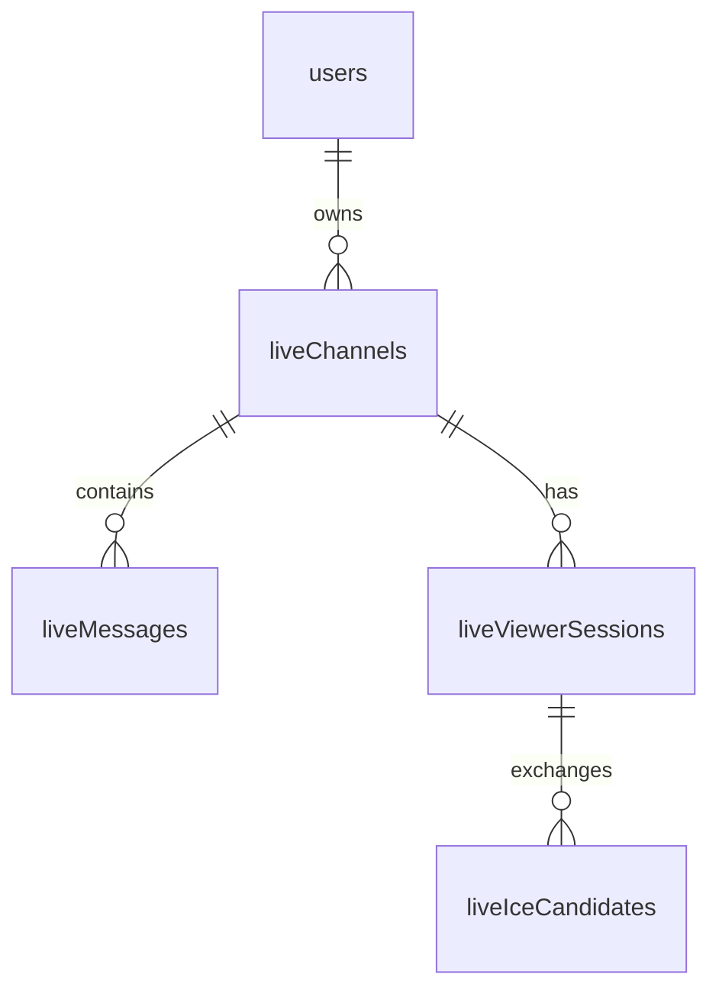

# Documentación del proyecto Shopp

**Repositorio analizado:** `shopp-main(9).zip`  
**Fecha de revisión:** 2026-09-04  
**Aplicación:** Shopp 1.0.0

Shopp es una aplicación multiplataforma construida con **Expo + React Native + React Native Web**, con **Convex** como backend reactivo y sistema de autenticación. La misma base de código sirve iOS, Android y Web/PWA.

El proyecto ya no es únicamente una lista de compra. El repositorio actual reúne varias utilidades relacionadas:

- listas de compra e histórico;
- tiendas, favoritos, ubicación y parking;
- escáner y catálogo de productos por código de barras;
- clasificación de productos (Alimentos, Supermercado, Libros y Música);
- chat y tratamiento de enlaces;
- Biblioteca de enlaces, noticias, periódicos y librerías;
- playlists de YouTube;
- Shopp Live mediante WebRTC;
- Fire Alarm mediante WebRTC;
- perfil, autenticación, roles administrativos y recuperación por correo;
- importación/exportación y copias ZIP locales.

## Índice de documentos

| Documento | Contenido |
|---|---|
| [01_VISION_GENERAL.md](01_VISION_GENERAL.md) | Objetivo, alcance, plataformas y capacidades. |
| [02_ARQUITECTURA.md](02_ARQUITECTURA.md) | Arquitectura cliente/backend, navegación, persistencia y flujos. |
| [03_MODULOS_FUNCIONALES.md](03_MODULOS_FUNCIONALES.md) | Descripción funcional y técnica por utilidad. |
| [04_MODELO_DATOS_CONVEX.md](04_MODELO_DATOS_CONVEX.md) | Tablas Convex, ownership y relaciones principales. |
| [05_DESARROLLO_LOCAL.md](05_DESARROLLO_LOCAL.md) | Instalación, variables, comandos y flujo de desarrollo. |
| [06_DESPLIEGUE_PWA_Y_EAS.md](06_DESPLIEGUE_PWA_Y_EAS.md) | Netlify, PWA y builds nativas con EAS. |
| [07_SEGURIDAD_Y_PRIVACIDAD.md](07_SEGURIDAD_Y_PRIVACIDAD.md) | Fronteras de confianza, secretos, WebRTC, permisos y datos. |
| [08_PRUEBAS_MANTENIMIENTO_Y_DEUDA_TECNICA.md](08_PRUEBAS_MANTENIMIENTO_Y_DEUDA_TECNICA.md) | Tests actuales, mantenimiento y deuda técnica observada. |
| [09_MAPA_DEL_REPOSITORIO.md](09_MAPA_DEL_REPOSITORIO.md) | Directorios y ficheros principales. |

## Stack principal detectado

- Expo `~57.0.18`
- React `19.2.3`
- React Native `0.86.3`
- React Native Web `^0.21.0`
- Convex `^1.42.2`
- `@convex-dev/auth`
- React Navigation 7
- Expo Camera / Location / File System / Image / Clipboard
- React Leaflet para mapas web
- ZXing / html5-qrcode para lectura de códigos
- Resend para OTP de correo
- Netlify para la exportación web/PWA
- EAS para builds iOS/Android

## Principio arquitectónico

La aplicación tiene dos dominios de persistencia diferentes y deliberados:

1. **Estado local del dispositivo**: listas, ajustes, cachés, historial local, imágenes locales y preferencias.
2. **Estado compartido/remoto en Convex**: identidad, perfiles, chat, parking, Biblioteca, caché compartida de productos, playlists, Fire Alarm, Shopp Live y otros datos sincronizados.

Esta distinción es importante: borrar un dato local **no implica** borrar su equivalente remoto, salvo que una función concreta implemente ambas operaciones.

## Estado de la documentación

Estos documentos describen el código presente en el ZIP analizado. Cuando la documentación histórica existente contradice al código actual, se toma el código como referencia.


---

# Visión general

## 1. Propósito

Shopp es una aplicación personal/colaborativa orientada inicialmente a organizar compras y que ha evolucionado hacia una PWA modular con servicios asociados a productos, enlaces, comunicación y geolocalización.

La intención técnica del proyecto es mantener **una sola base de código JavaScript** para:

- iOS;
- Android;
- navegador web;
- instalación como PWA.

## 2. Superficies principales de usuario

La navegación principal autenticada se divide en cinco pestañas:

1. **Shopping**
2. **Tiendas**
3. **Chat**
4. **Scanner**
5. **Menu**

Desde el stack de Shopping se exponen además utilidades como:

- Fire Alarm;
- Tutor de Inglés;
- Biblioteca;
- Play List;
- Shopp Live.

Sin sesión, `AppNavigator` presenta el stack de autenticación.

## 3. Capacidades actuales

### Shopping

- múltiples listas de compra;
- items con cantidad, unidad y precio;
- categorías y subcategorías;
- selección de tienda;
- promociones y ahorro;
- archivado;
- histórico de compras.

### Scanner y productos

- lectura de códigos de barras en móvil y web;
- entrada/edición manual;
- historial local y sincronización opcional con Convex;
- caché compartida de producto;
- revisión administrativa de aportaciones;
- imágenes de producto locales y temporales remotas;
- tipos principales: **Alimentos, Supermercado, Libros, Música**.

### Tiendas y Parking

- catálogo de tiendas;
- favoritos por usuario;
- tiendas cercanas;
- uso de geolocalización;
- destinos de Parking;
- presencia y estados de usuario;
- plazas compartidas y eventos de aparcamiento;
- estadísticas y notificaciones asociadas.

### Chat

- salas;
- mensajes en tiempo real;
- alias de usuario;
- imágenes;
- contenido de producto;
- YouTube y playlists;
- análisis y estado de URLs;
- moderación y borrado por usuario/administrador;
- caducidad de mensajes mediante cron.

### Biblioteca

- carpetas jerárquicas;
- enlaces generales;
- noticias;
- fuentes/periódicos;
- tiendas y enlaces de libros;
- títulos personalizados;
- notas;
- hashtags;
- favoritos;
- fecha de publicación;
- búsqueda y ordenación;
- importación/exportación;
- trabajos de importación reanudables.

### Play List

- playlists propias por usuario;
- singles y álbumes/listas de YouTube;
- letras almacenables como ficheros.

### Shopp Live

- canales de emisión;
- modo URL de reproducción externa;
- modo cámara en PWA;
- WebRTC entre emisor y espectadores;
- señalización mediante Convex;
- `RTCDataChannel` bidireccional;
- límite visual/funcional de hasta 4 espectadores en la implementación de cámara.

### Fire Alarm

- activación desde cámara web/PWA;
- creación de alarma en Convex;
- snapshot opcional;
- WebRTC P2P para vídeo;
- STUN por defecto y TURN opcional;
- administración/acuse/resolución de alarmas.

### Cuenta y administración

- registro con contraseña;
- verificación OTP por correo;
- recuperación OTP por correo;
- roles `user` / `admin`;
- perfil y alias;
- gestión de usuarios por administrador;
- revisión de productos aportados.

## 4. Plataformas

| Capacidad | Web/PWA | iOS | Android |
|---|---:|---:|---:|
| Listas | Sí | Sí | Sí |
| Convex/Auth | Sí | Sí | Sí |
| Biblioteca | Sí | Sí, con diferencias de almacenamiento/importación | Sí, con diferencias de almacenamiento/importación |
| Cámara scanner | Sí, si el navegador lo permite | Sí | Sí |
| Ubicación | Sí | Sí | Sí |
| Shopp Live cámara | Sí | No en la implementación actual | No en la implementación actual |
| Fire Alarm cámara | Sí | No en la fase actual | No en la fase actual |
| PWA instalable | Sí | N/A como web instalada | N/A como web instalada |

## 5. Decisiones de diseño relevantes

- **Backend reactivo**: Convex evita implementar un socket server separado para el estado compartido convencional.
- **WebRTC no transporta vídeo por Convex**: Convex actúa como plano de señalización; el media stream circula P2P o por TURN.
- **Offline parcial**: existe persistencia local, pero las consultas remotas no se convierten automáticamente en offline.
- **Autorización backend**: las operaciones sensibles deben validar usuario/rol en Convex, no solo ocultar controles en UI.
- **PWA y nativo comparten código**, pero determinadas capacidades se aíslan por `Platform.OS` o archivos `.web.js` / `.native.js`.


---

# Arquitectura

## 1. Entrada de la aplicación

`App.js` construye la raíz de Shopp:

```text
I18nProvider
└── SafeAreaProvider
    └── ConvexAuthProvider
        └── ListsProvider
            └── StoresProvider
                └── LocationProvider
                    ├── NavigationContainer
                    │   └── AppNavigator
                    └── DialogHost (solo Web)
```

El cliente Convex se instancia con:

```js
new ConvexReactClient(process.env.EXPO_PUBLIC_CONVEX_URL)
```

Por tanto, `EXPO_PUBLIC_CONVEX_URL` es una configuración **pública de frontend**, no un secreto.

## 2. Flujo de autenticación

`AppNavigator` usa los componentes de `@convex-dev/auth/react`:



En el backend, `convex/auth.js` usa `Password` y dos proveedores Resend OTP:

- `ResendOTPEmailVerification`;
- `ResendOTPPasswordReset`.

Al crear/actualizar un usuario, si no tiene rol se asigna `user`.

## 3. Navegación autenticada



La navegación está centralizada en `src/navigation/ROUTES.js`.

## 4. Arquitectura de datos

Shopp mezcla persistencia local y remota.



### Estado local

La carpeta `src/storage/` abstrae diferencias de plataforma. Entre las claves canónicas se encuentran:

- `@shopping/lists`
- `@shopping/history`
- `@shopping/purchases`
- `@shopping/scanned-items`
- `@shopping/stores`
- `@shopping/favorite-stores`
- `@shopping/barcode-settings`
- `@shopping/language`
- cachés de ubicación y distancia.

Existe además `getUserScopedStorageKey()` para aislar datos por usuario.

### Estado remoto

Convex mantiene dominios como:

- usuarios/perfiles;
- productos/caché/revisiones;
- historial sincronizado de escaneos;
- chat;
- Biblioteca;
- parking;
- tiendas/favoritos;
- playlists;
- Fire Alarm;
- Shopp Live.

## 5. Backend Convex

Cada fichero en `convex/` agrupa queries, mutations, actions o tareas internas por dominio.

Patrones relevantes:

- `getAuthUserId(ctx)` para obtener identidad;
- `requireUser(ctx)` / `requireAdmin(ctx)` en `convex/lib/auth.js`;
- índices explícitos para consultas frecuentes;
- `ctx.storage` para ficheros;
- `crons.js` para limpieza periódica.

## 6. Cron jobs

El repositorio configura actualmente:

- limpieza horaria de adjuntos temporales de denuncias;
- limpieza cada 6 horas de imágenes temporales de productos;
- limpieza horaria de mensajes de chat caducados.

Los jobs invocan funciones `internal` de Convex.

## 7. Biblioteca e importaciones largas

`src/screens/library/LibraryScreen.js` implementa una estrategia específica para importaciones grandes:

- lotes de lectura/escritura;
- persistencia temporal del payload;
- `libraryImportJobs` en Convex para registrar progreso;
- IndexedDB en web;
- `expo-file-system` en nativo;
- reintentos con backoff;
- modo `combine` o `replace`;
- fases separadas para enlaces y fuentes.

Esto evita depender de una única operación larga y reduce el riesgo de perder progreso ante recargas/interrupciones.

## 8. WebRTC: plano de control vs plano de media

### Shopp Live

- Convex almacena canal, sesiones, offer/answer e ICE candidates.
- `RTCPeerConnection` transporta audio/vídeo.
- `RTCDataChannel` transporta datos P2P.
- El broadcaster usa actualmente STUN público de Google.

### Fire Alarm

- Convex almacena la alarma y mensajes de señalización.
- El vídeo no pasa por Convex.
- ICE usa STUN y puede añadir TURN si se configuran variables específicas.



## 9. PWA

La exportación web usa Metro y `web.output = "single"`.

Elementos principales:

- `public/manifest.webmanifest`;
- `public/sw.js`;
- `public/_redirects`;
- redirección Netlify `/* -> /index.html`.

El service worker aporta caché del shell, pero no convierte la base remota de Convex en un datastore offline completo.


---

# Módulos funcionales

## 1. Shopping

**Pantallas principales**

- `ShoppingListsScreen.js`
- `ShoppingListScreen.js`
- `ItemDetailScreen.js`
- `ArchivedListsScreen.js`
- `PurchaseHistoryScreen.js`
- `PurchaseDetailScreen.js`

**Estado principal**

- `ListsContext`
- persistencia local bajo `src/storage`

**Responsabilidades**

- CRUD de listas;
- items de compra;
- cantidades/unidades/precios;
- categorías;
- promociones;
- asociación con tienda;
- archivado e histórico.

## 2. Scanner y productos

**Pantallas**

- `ScannerTabScreen.js`
- `ProductBarcodeScannerScreen.js`
- `NewProductScannerScreen2.js`
- `EditScannedItemScreen.js`
- `ScannedHistoryScreen.js`

**Tipos de producto**

Definidos en `src/constants/productSearchTypes.js`:

- Alimentos
- Supermercado
- Libros
- Música

El tipo por defecto es **Alimentos**.

**Piezas técnicas**

- `barcodeNormalization.js`
- `scannedProductModel.js`
- `scannerHistory.js`
- `scannedHistorySync.js`
- `useScannedHistoryStorage.js`
- `useScanHistoryConvex.js`
- `productLookup.js`
- `productCache.js` (Convex)

**Persistencia**

El proyecto tiene varias generaciones de datos de scanner:

- historial local canónico;
- `userScanHistory` para historial por usuario sincronizable;
- `scanHistory` como tabla más simple/legacy;
- `barcodeScans` para lecturas con consentimiento;
- `productCache` para datos reutilizables por barcode;
- `productReviewSubmissions` para cambios pendientes de aprobación.

Conviene considerar estas tablas como dominios distintos y evitar tratarlas como si fueran una sola colección.

## 3. Tiendas

**Pantallas**

- Home
- Browse
- Favorites
- Nearby
- Detail
- Info
- Select

**Backend**

- `convex/stores.js`
- `convex/storeFavorites.js`

**Modelo**

`stores` contiene el catálogo. `userStoreFavorites` mantiene la relación usuario-tienda; el campo `stores.favorite` está marcado en schema como heredado y no debe ser la fuente canónica para favoritos personales.

## 4. Parking

**Pantallas**

- `ParkingScreen.js`
- `ParkingSettingsScreen.js`
- `ParkingGpsDebugScreen.js`
- `ParkingSpotsSection.js`

**Backend**

- `convex/parking.js`

**Tablas relacionadas**

- `parkingPresence`
- `parkingDestinations`
- `parkingGpsMeasurements`
- `parkingSpots`
- `parkingWatchers`
- `parkingNotifications`
- `parkingAreaStats`
- `parkingMessages`

Parking combina datos efímeros (presencia), datos permanentes (destinos), eventos/plazas compartidas y telemetría/estadísticas.

## 5. Chat

**Pantallas**

- `ChatScreen.js`
- `ChatScreenResponsive.js`
- `ChatPrototypeScreen.js`
- `YesterdayNewsScreen.js`

**Backend**

- `convex/chat.js`
- `convex/linkPreviews.js`

**Capacidades detectadas**

- sala;
- usuario/alias;
- texto;
- imágenes en Convex Storage;
- referencias de producto;
- álbum/playlists de YouTube;
- extracción y clasificación de URLs;
- estados de seguridad para URLs;
- estados de moderación;
- borrado por propietario o administrador;
- TTL de mensajes.

El backend define `MESSAGE_TTL_MS = 24 horas`; el cron de limpieza corre cada hora. Si el producto pretende conservar mensajes indefinidamente, esta política debe revisarse en código backend.

## 6. Biblioteca

**Pantalla principal**

- `src/screens/library/LibraryScreen.js`

Existe además `src/screens/chat/LibraryScreen.js`, por lo que hay que evitar confundir ambas implementaciones al mantener el proyecto.

**Backend**

- `convex/computerLinks.js`

**Entidades**

### Carpetas

`computerLinkFolders` permite jerarquía mediante `parentFolderId`.

Carpetas raíz predeterminadas presentes en backend:

- Noticias
- Libros
- Informática
- Política
- Ingeniería
- Música

### Enlaces

`computerLinks.linkType` distingue:

- `general`
- `newsSource`
- `newsArticle`
- `bookStore`
- `bookLink`

Campos importantes:

- URL original/canónica;
- hostname;
- carpeta;
- fuente/dominio;
- título personalizado;
- favorito;
- estado;
- notas;
- hashtags;
- fecha de publicación;
- fechas de creación/actualización.

### Importación

La pantalla persiste el payload de importación en IndexedDB (Web) o FileSystem (nativo) y el progreso remoto en `libraryImportJobs`.

Constantes relevantes de la implementación actual:

- vista inicial limitada a 80 enlaces;
- hasta 600 fuentes de catálogo en ciertos flujos;
- página de búsqueda: 40;
- escaneo de hashtags por lotes/páginas;
- importaciones enriquecidas con límite específico.

No debe confundirse el límite de elementos **renderizados/consultados en una vista** con el número total de enlaces almacenados en Convex.

## 7. Play List

**Pantalla**

- `src/screens/playlist/PlayListScreen.js`

**Backend**

- `convex/playlists.js`

**Tabla**

`youtubePlaylists` guarda una playlist por propietario con tracks de tipo single/album, URL, IDs de YouTube y letras opcionales en Convex Storage.

## 8. Shopp Live

**Pantallas**

- `ShoppLiveScreen.js`
- `LiveCameraWeb.js`

**Backend**

- `convex/live.js`

**Modos**

1. **External**: reproducción mediante URL (vídeo directo/iframe).
2. **Camera**: captura `getUserMedia()` y WebRTC.

**WebRTC camera**

- vídeo 1280×720 ideal;
- audio activado (`audio: true`);
- un peer por sesión de viewer;
- `RTCDataChannel` llamado `shopp-live-data`;
- STUN: `stun:stun.l.google.com:19302`;
- estado de sesiones e ICE persistido temporalmente vía Convex.

La UI muestra la emisión de cámara como funcionalidad PWA; nativo presenta mensaje de no disponibilidad.

## 9. Fire Alarm

**Pantalla**

- `src/screens/webRtcFireAlarm/WebRtcFireAlarmScreen.js`

**Backend**

- `convex/fireAlarm.js`

**Tablas**

- `fireAlarms`
- `fireAlarmSignals`

**Características**

- cámara web/PWA;
- captura de vídeo sin audio;
- estados `pending`, `acknowledged`, `cancelled`, `resolved`;
- acceso del propietario y administrador;
- WebRTC con STUN;
- TURN opcional;
- snapshot en Convex Storage.

## 10. Perfil y administración

**Pantallas**

- `ProfileScreen.js`
- `AvatarEditorScreen.js`
- `AdminUsersScreen.js`
- `AdminProductReviewsScreen.js`

**Backend**

- `convex/users.js`
- `convex/productReviewSubmissions.js`
- `convex/lib/auth.js`

El perfil complementa la tabla Auth `users` con `userProfiles`, que contiene alias, avatar, teléfono, visibilidad y preferencia de sincronización del historial de escaneos.

## 11. Backup e import/export

Hay dos mecanismos conceptualmente distintos:

### Export JSON de usuario

`src/services/exportUserData.js` exporta listas, histórico, escaneos y perfil en JSON.

### Backup ZIP completo local

`src/services/backupZip.js` y `src/utils/zipStore.js` generan un ZIP con:

- `manifest.json`;
- `data.json`;
- imágenes locales;
- hashes SHA-256 cuando están disponibles;
- validación CRC del ZIP;
- restauración `merge` o `replace`.

El backup ZIP representa principalmente **estado local**; no es un volcado completo de todas las tablas de Convex.


---

# Modelo de datos Convex

Fuente canónica: `convex/schema.js` del repositorio analizado.

## 1. Identidad

| Tabla | Propósito | Claves/índices relevantes |
|---|---|---|
| `users` | Tabla de Convex Auth ampliada con `role`. | `email` |
| `userProfiles` | Alias, avatar, teléfono y preferencias. | `by_userId`, `by_alias`, `by_phone` |

El rol admitido por schema es `user` o `admin`.

## 2. Productos y scanner

| Tabla | Propósito |
|---|---|
| `products` | Catálogo base por barcode. |
| `productContributions` | Aportaciones de producto con snapshot y consentimiento. |
| `userScanHistory` | Historial de escaneo por usuario, rico y sincronizable. |
| `temporaryProductImages` | Pareja detail/thumbnail temporal por usuario y barcode. |
| `scanHistory` | Historial/caché más simple por barcode. |
| `barcodeScans` | Evento de lectura con consentimiento explícito. |
| `productCache` | Caché compartida, estado y control de reintentos externos. |
| `productReviewSubmissions` | Cambios remitidos a revisión administrativa. |
| `shoppingItemsImport` | Staging/importación de items locales a Convex. |

### Flujo recomendado de interpretación



No todas las ramas se ejecutan necesariamente en cada escaneo; dependen del flujo de UI y permisos.

## 3. Chat y Biblioteca

| Tabla | Propósito |
|---|---|
| `chatMessages` | Mensajes, multimedia, producto, YouTube y seguridad URL. |
| `computerLinkFolders` | Carpetas jerárquicas de Biblioteca. |
| `computerLinks` | Enlaces de Biblioteca/noticias/fuentes/libros. |
| `libraryImportJobs` | Progreso reanudable de importaciones grandes. |

### `computerLinks.linkType`

```text
general
newsSource
newsArticle
bookStore
bookLink
```

### `computerLinks.status`

```text
pending
reviewed
archived
```

## 4. Comunicaciones con administración

| Tabla | Propósito |
|---|---|
| `rightsReportAttachments` | Adjuntos temporales enviados a administración. |

Los comentarios de schema indican que estos adjuntos se eliminan del storage después del envío y existe además limpieza de expirados por cron.

## 5. Fire Alarm

| Tabla | Propósito |
|---|---|
| `fireAlarms` | Alarma, propietario, estado, snapshot y administración. |
| `fireAlarmSignals` | Offer/answer/ICE de señalización WebRTC. |

Estados de alarma:

```text
pending -> acknowledged -> resolved
     \-> cancelled
```

## 6. Parking

| Tabla | Propósito |
|---|---|
| `parkingPresence` | Presencia/estado actual por usuario y zona. |
| `parkingDestinations` | Destinos permanentes. |
| `parkingGpsMeasurements` | Medidas GPS administrativas. |
| `parkingSpots` | Plazas/eventos georreferenciados. |
| `parkingWatchers` | Observadores interesados en una zona/plaza. |
| `parkingNotifications` | Notificaciones generadas por Parking. |
| `parkingAreaStats` | Contadores agregados por área. |
| `parkingMessages` | Mensajes/eventos de estado de Parking. |

### Estados detectados

Presencia:

```text
heading | looking | parked | leaving | offline
```

Plaza:

```text
free | occupied | leaving | unknown | expired
```

Mensajes/estado funcional:

```text
looking | parked | leaving
```

Schema conserva además valores legacy de chat en determinados campos para compatibilidad.

## 7. Tiendas

| Tabla | Propósito |
|---|---|
| `stores` | Catálogo global de tiendas. |
| `userStoreFavorites` | Relación usuario-tienda favorita. |

**Importante:** el campo `stores.favorite` está documentado como heredado. La preferencia personal debe modelarse con `userStoreFavorites`.

## 8. Playlists

| Tabla | Propósito |
|---|---|
| `youtubePlaylists` | Playlists por propietario con array de tracks y letras opcionales. |

## 9. Shopp Live

| Tabla | Propósito |
|---|---|
| `liveChannels` | Metadatos y estado de cada canal. |
| `liveMessages` | Chat del canal Live. |
| `liveViewerSessions` | Señalización por viewer: offer/answer/estado. |
| `liveIceCandidates` | ICE candidate por sesión y lado. |

### Relaciones



## 10. Ownership y seguridad

El schema por sí solo no aplica ACLs. La protección depende de las funciones de `convex/*.js`.

Patrones existentes:

- funciones que derivan usuario desde Convex Auth;
- validación de propietario;
- `requireAdmin` para tareas administrativas;
- índices por `userId`, `ownerId`, `submittedBy`, etc.

Cuando se añada una nueva query/mutation, debe definirse explícitamente:

1. quién puede leer;
2. quién puede escribir;
3. quién puede borrar;
4. si un admin puede actuar sobre datos de terceros;
5. si el dato debe caducar o conservarse.


---

# Desarrollo local

## 1. Requisitos

- Node.js y npm.
- Proyecto Convex disponible.
- Expo toolchain.
- Navegador moderno para PWA/WebRTC.
- Dispositivo o simulador para pruebas nativas.

Netlify está configurado con **Node 24** para build.

## 2. Instalación

```bash
npm install
```

Copia `.env.example` a `.env.local` y configura al menos:

```env
EXPO_PUBLIC_CONVEX_URL=https://TU_DEPLOYMENT.convex.cloud
```

## 3. Desarrollo en dos terminales

Terminal 1 — backend:

```bash
npx convex dev
```

Terminal 2 — cliente:

```bash
npx expo start -c
```

No es necesario que `npx convex dev` termine: es un proceso de desarrollo que permanece escuchando cambios. Por eso se ejecuta en una terminal separada.

## 4. Scripts npm definidos

```bash
npm start
npm run start:clean
npm run android
npm run ios
npm run web
npm run build
```

Equivalencias relevantes:

- `start`: `expo start`
- `start:clean`: `expo start -c`
- `web`: `expo start --web`
- `build`: `expo export --platform web`

También hay scripts de datos Factory:

```bash
npm run factory:export
npm run factory:import
npm run factory:reset
```

## 5. Variables públicas de frontend detectadas

```text
EXPO_PUBLIC_CONVEX_URL
EXPO_PUBLIC_APP_VERSION
EXPO_PUBLIC_NETLIFY_SITE_NAME
EXPO_PUBLIC_SOCKET_URL
EXPO_PUBLIC_FIREALARM_TURN_URL
EXPO_PUBLIC_FIREALARM_TURN_USERNAME
EXPO_PUBLIC_FIREALARM_TURN_CREDENTIAL
```

Toda variable `EXPO_PUBLIC_*` puede terminar en el bundle del navegador. **No debe contener secretos permanentes.**

`EXPO_PUBLIC_SOCKET_URL` corresponde a infraestructura histórica/legacy según `.env.example` y `config/env.js`; Convex es el backend principal actual.

## 6. Variables de backend detectadas

Entre las referencias del repositorio aparecen:

```text
AUTH_RESEND_KEY
CONVEX_SITE_URL
OPENAI_API_KEY
RESEND_API_KEY
RESEND_FROM_EMAIL
```

También aparecen nombres legacy/auxiliares como `DATABASE_URL`, `APP_TOKEN`, `OWNER_KEY`, `CLIENT_ORIGIN`, `PORT`, `PGSSL` en partes del árbol. Antes de utilizarlos, confirmar que el fichero correspondiente forma parte del runtime actual y no de código histórico.

Para Convex, un secreto se configura normalmente en el deployment, por ejemplo:

```bash
npx convex env set AUTH_RESEND_KEY "..."
```

## 7. Alias `@/`

El proyecto usa imports como:

```js
import { api } from "@/convex/_generated/api";
import { storage } from "@/src/storage";
```

Por tanto, al mover código o configurar herramientas externas hay que respetar `jsconfig.json` / `tsconfig.json` y la resolución de alias.

## 8. Flujo recomendado al modificar una utilidad

1. Localizar pantalla en `src/screens/<dominio>/`.
2. Revisar su stack y ruta en `src/navigation/`.
3. Revisar hooks/context/services usados.
4. Determinar si el dato es local, remoto o híbrido.
5. Si usa Convex, revisar schema e índices antes de modificar queries.
6. Mantener autorización backend.
7. Probar Web y al menos una plataforma nativa si el cambio toca APIs de Expo.
8. Ejecutar tests.
9. Ejecutar build web antes de desplegar.

## 9. Convenciones prácticas observadas

- JavaScript como lenguaje principal de UI.
- TypeScript presente para configuración/generados de Convex, pero no como estilo dominante de pantallas.
- Componentes específicos por plataforma cuando hace falta (`.web.js`, `.native.js`).
- `safeAlert` abstrae diálogos nativos vs web.
- `Platform.OS` se usa ampliamente para degradación progresiva de capacidades.

## 10. Limpieza de caché

Ante inconsistencias de Metro/Expo:

```bash
npx expo start -c
```

Si el problema está en schema/functions de Convex, mantener también `npx convex dev` ejecutándose para regenerar y sincronizar las funciones.


---

# Despliegue: PWA, Netlify y EAS

## 1. Web/PWA

### Build

`netlify.toml` define:

```toml
[build]
command = "npx expo export -p web"
publish = "dist"
```

El script npm equivalente es:

```bash
npm run build
```

### Node

Netlify fija:

```toml
NODE_VERSION = "24"
```

Conviene reproducir esa major version en CI/local al investigar diferencias de build.

### SPA routing

Netlify redirige cualquier ruta a `index.html`:

```toml
[[redirects]]
from = "/*"
to = "/index.html"
status = 200
```

Esto permite que React Navigation maneje rutas cliente sin 404 al recargar.

## 2. Configuración PWA

`app.json` configura Web con:

- `output: single`;
- bundler Metro;
- display `standalone`;
- idioma `es`;
- scope `/`;
- start URL `/`;
- orientación portrait-primary.

El repositorio contiene además:

- `public/manifest.webmanifest`;
- `public/sw.js`;
- `public/_redirects`.

## 3. Headers de seguridad actuales

Netlify añade:

```text
Permissions-Policy: camera=(self), microphone=()
X-Content-Type-Options: nosniff
```

### Conflicto funcional detectado

`LiveCameraWeb.js` solicita:

```js
getUserMedia({ video: ..., audio: true })
```

pero el header de Netlify define:

```text
microphone=()
```

Eso deshabilita el micrófono para el documento, aunque el usuario haya dado permiso al navegador. Si **Shopp Live debe transmitir audio**, este header debe cambiarse de forma controlada, por ejemplo permitiendo micrófono a `self`.

Fire Alarm no tiene este conflicto porque su implementación actual solicita `audio: false`.

## 4. Variables de entorno en producción web

Como mínimo:

```text
EXPO_PUBLIC_CONVEX_URL
```

Opcionales según funcionalidad:

```text
EXPO_PUBLIC_APP_VERSION
EXPO_PUBLIC_NETLIFY_SITE_NAME
EXPO_PUBLIC_FIREALARM_TURN_URL
EXPO_PUBLIC_FIREALARM_TURN_USERNAME
EXPO_PUBLIC_FIREALARM_TURN_CREDENTIAL
```

No introducir secretos de API permanentes en variables `EXPO_PUBLIC_*`.

## 5. Service worker

`/sw.js` se publica con:

```text
Cache-Control: no-cache
```

Esto facilita que el navegador compruebe actualizaciones del service worker. El manifiesto tiene caché de una hora.

Después de un despliegue, validar:

- que se descarga el bundle nuevo;
- que no queda una versión antigua controlada por un service worker previo;
- que autenticación/Convex apuntan al deployment correcto.

## 6. Checklist de despliegue PWA

1. `npm install` limpio si se ha actualizado lockfile.
2. Confirmar `EXPO_PUBLIC_CONVEX_URL` de producción.
3. Desplegar/sincronizar Convex.
4. Ejecutar tests.
5. Ejecutar `npm run build`.
6. Probar `dist/` o deploy preview.
7. Verificar login/registro/OTP.
8. Verificar listas y persistencia local.
9. Verificar scanner/cámara en HTTPS.
10. Verificar Biblioteca con dataset realista.
11. Verificar Parking/geolocalización.
12. Verificar Shopp Live desde dos dispositivos si se ha tocado WebRTC.
13. Verificar instalación como PWA.

## 7. Builds nativas con EAS

`eas.json` define tres perfiles:

### development

- development client;
- distribución interna.

### preview

- distribución interna;
- Android APK.

### production

- auto incremento;
- Android App Bundle.

El proyecto EAS está asociado mediante `extra.eas.projectId` en `app.json`.

## 8. Identificadores de aplicación

### iOS

```text
com.ramnworksshopp.shopp
```

### Android

```text
com.ramnworksshopp.shopp
```

## 9. Permisos nativos declarados

Android declara:

- CAMERA
- RECORD_AUDIO
- ACCESS_COARSE_LOCATION
- ACCESS_FINE_LOCATION

Los plugins Expo incluyen mensajes de permiso de cámara, micrófono y ubicación.


---

# Seguridad y privacidad

## 1. Frontera de confianza

La regla principal del proyecto debe ser:

> El cliente no es una frontera de seguridad.

Todo código React Native/Web puede ser inspeccionado o manipulado por el usuario. Por ello:

- ocultar un botón de admin no autoriza una operación;
- validar `isAdmin` solo en UI no es suficiente;
- IDs de usuario enviados por cliente no deben aceptarse como prueba de identidad;
- secretos no deben incluirse en el bundle.

## 2. Autenticación y roles

Convex Auth gestiona la identidad.

`convex/lib/auth.js` proporciona:

- `requireUser(ctx)`;
- `requireAdmin(ctx)`.

`requireAdmin` acepta el rol `admin` (y contempla compatibilidad con `isAdmin === true`).

Las funciones sensibles de dominios como usuarios, live, revisiones y shopping import llaman a comprobaciones administrativas.

Al crear nuevas funciones Convex, reutilizar estos patrones en vez de confiar en la navegación del frontend.

## 3. Secretos

### Variables seguras de backend

Ejemplos:

- `AUTH_RESEND_KEY`
- `OPENAI_API_KEY`
- otros tokens de servicios externos ejecutados exclusivamente server-side.

Deben residir en el entorno de Convex/proveedor backend.

### Variables públicas

Cualquier `EXPO_PUBLIC_*` es visible para el cliente.

Esto es correcto para:

- URL pública de Convex;
- versión de app;
- nombre de sitio;
- URLs públicas sin capacidad privilegiada.

No es correcto para claves permanentes con capacidad de facturación/escritura.

## 4. TURN en Fire Alarm

La implementación admite:

```text
EXPO_PUBLIC_FIREALARM_TURN_URL
EXPO_PUBLIC_FIREALARM_TURN_USERNAME
EXPO_PUBLIC_FIREALARM_TURN_CREDENTIAL
```

El propio repositorio advierte correctamente que estas variables quedan visibles en navegador.

Para producción:

- no usar una contraseña TURN estática de larga duración;
- preferir credenciales temporales/efímeras;
- emitirlas desde un backend autenticado;
- limitar TTL y, si el proveedor lo permite, scope/uso.

## 5. Shopp Live y NAT traversal

Shopp Live usa actualmente solo STUN público en `LiveCameraWeb.js`.

Consecuencia:

- funcionará en muchos casos P2P;
- puede fallar en NAT simétrico, redes corporativas, CGNAT o firewalls restrictivos;
- para fiabilidad de producción se necesita una estrategia TURN.

Si se añade TURN, aplicar el mismo principio de credenciales temporales.

## 6. Permisos de navegador

Cámara, micrófono y ubicación requieren HTTPS fuera de `localhost` y consentimiento del usuario.

El header `Permissions-Policy` puede bloquear una capacidad antes incluso de que se muestre el prompt del navegador.

En el estado actual de `netlify.toml`:

- cámara: permitida a `self`;
- micrófono: bloqueado.

Esto es incompatible con el audio de Shopp Live.

## 7. Datos de geolocalización

Parking almacena coordenadas, precisión y estados de presencia/plaza.

Recomendaciones:

- limitar retención de presencia efímera;
- evitar conservar coordenadas históricas sin necesidad de producto;
- proteger queries por contexto de usuario/rol;
- documentar al usuario cuándo y con qué finalidad se comparte ubicación;
- no usar datos de debug GPS como sustituto silencioso de preferencias de usuario.

## 8. Imágenes y ficheros

El proyecto usa almacenamiento local y Convex Storage.

Casos con expiración explícita:

- imágenes temporales de producto;
- adjuntos temporales de comunicaciones a administración.

Los crons limpian ambos dominios.

Para cualquier nueva subida:

1. validar autenticación;
2. limitar tamaño y MIME;
3. evitar aceptar nombres de fichero como ruta confiable;
4. borrar ficheros huérfanos;
5. definir TTL cuando el recurso sea temporal.

## 9. URLs y contenido externo

`chatMessages` puede guardar información de análisis de URLs y estados como:

- trusted;
- safe;
- pending;
- suspicious;
- malicious;
- blocked;
- unknown.

La Biblioteca normaliza URLs y elimina determinados parámetros de tracking locales.

Al enriquecer enlaces desde servidor, protegerse frente a SSRF:

- permitir únicamente `http/https`;
- bloquear loopback/redes privadas/metadata endpoints;
- limitar redirects;
- aplicar timeout y límite de tamaño;
- no descargar contenido arbitrario sin validación.

## 10. Exportaciones y backups

Los JSON y ZIP pueden contener información personal/local del usuario.

El backup ZIP implementa CRC y hashes de contenido, lo cual ayuda a detectar corrupción, pero **no cifra** el backup.

Si se almacenan copias en servicios externos, tratarlas como datos potencialmente sensibles.

## 11. Denegación de servicio y costes

Convex es reactivo: una query mal dimensionada o una mutación repetida desde bots puede incrementar consumo.

Medidas recomendadas:

- paginación;
- límites de tamaño;
- índices adecuados;
- throttling/rate limiting en acciones críticas;
- evitar búsquedas remotas por cada pulsación de teclado;
- deduplicación por URL/barcode/fingerprint;
- trabajos por lotes para importaciones masivas;
- límites por usuario para upload y WebRTC signaling.

La Biblioteca ya adopta varias de estas técnicas: paginación, lotes, fingerprints, límites y trabajos reanudables.


---

# Pruebas, mantenimiento y deuda técnica

## 1. Suite de tests presente

El repositorio contiene pruebas Node en `tests/`:

- `dialog-behavior.test.mjs`
- `scanned-product-flow.test.mjs`
- `zip-store.test.mjs`
- helper `test-loader.mjs`

Ejecución utilizada durante esta revisión:

```bash
node --test tests/*.test.mjs
```

## 2. Resultado observado el 2026-09-04

```text
4 tests
2 passed
2 failed
```

### Pasan

- creación/lectura de ZIP almacenado;
- detección de corrupción mediante CRC.

### Falla: dialog-behavior

Error:

```text
Cannot use import statement outside a module
```

Causa probable: `safeAlert.js` incorporó un nuevo import (`tr` desde `@/src/i18n`) que el loader ad-hoc del test no sustituye. El test harness necesita actualizarse para manejar ese import o migrarse a un runner/transpilador más estándar.

### Falla: scanned-product-flow

El test espera que `product_type: "food"` produzca:

```text
Supermercado
```

pero el código actual normaliza `food` a:

```text
Alimentos
```

Por tanto, el fallo parece ser principalmente una **desalineación entre especificación del test y taxonomía actual**, no necesariamente un fallo del código. Debe decidirse cuál es el comportamiento canónico y actualizar test o implementación.

## 3. Falta un script npm `test`

`package.json` no define actualmente `test`.

Recomendación:

```json
{
  "scripts": {
    "test": "node --test tests/*.test.mjs"
  }
}
```

Una vez corregidos los tests, incorporar este comando a CI.

## 4. Cobertura prioritaria que falta

### Autenticación y autorización

- usuario no autenticado no puede mutar datos privados;
- user no puede invocar operaciones admin;
- admin sí puede realizar las operaciones esperadas;
- propietario no puede modificar datos de otro propietario salvo regla explícita.

### Biblioteca

- import combine sin duplicar URL;
- replace elimina únicamente el scope previsto;
- reanudación de import job;
- cancelación/interrupción;
- 477+ fuentes sin truncado lógico;
- búsqueda paginada;
- normalización de carpetas;
- integridad newsArticle ↔ newsSource.

### Scanner

- Alimentos/Supermercado/Libros/Música;
- round-trip local ↔ Convex;
- migración legacy;
- edición y cancelación;
- imágenes temporales;
- caché y revisión administrativa.

### WebRTC

- creación/cierre de sesión;
- máximo de viewers;
- limpieza de ICE;
- `RTCDataChannel`;
- fallback cuando no existe `getUserMedia`;
- STUN-only vs TURN;
- permisos bloqueados por navegador/header.

### Backup

- merge;
- replace;
- hashes inválidos;
- media ausente;
- versiones incompatibles;
- backup grande.

## 5. Deuda técnica observada

### 5.1 Dos pantallas `LibraryScreen`

Existen:

- `src/screens/library/LibraryScreen.js`
- `src/screens/chat/LibraryScreen.js`

La ruta activa del `ShoppingStack` usa la primera. La segunda puede ser legacy o tener otro propósito. Conviene renombrar/eliminar para reducir ambigüedad.

### 5.2 Configuración socket legacy

`config/env.js` y `.env.example` conservan `EXPO_PUBLIC_SOCKET_URL` y comentarios de Heroku/socket.io, mientras la arquitectura principal usa Convex.

Si ya no existe runtime dependiente del socket, eliminarlo para evitar configuración fantasma.

### 5.3 Varias tablas de historial/producto

Existen simultáneamente `products`, `productCache`, `scanHistory`, `userScanHistory`, `barcodeScans`, `productContributions` y `productReviewSubmissions`.

No es incorrecto, pero sí requiere documentación de ownership y lifecycle para evitar escribir el mismo concepto en varias tablas de manera divergente.

### 5.4 Taxonomía de producto en transición

El repositorio maneja tanto `Alimentos` como `Supermercado`. Tests antiguos aún asumen mappings previos. Se necesita una definición de dominio única y tests de compatibilidad legacy.

### 5.5 Netlify bloquea micrófono

`netlify.toml` usa `microphone=()`, pero Shopp Live pide audio. Esto explica posibles `Permission denied` o ausencia de audio en producción web.

### 5.6 Shopp Live sin TURN

La implementación de cámara utiliza solo STUN. No puede garantizar conectividad WebRTC en todas las redes.

### 5.7 Credenciales TURN públicas en Fire Alarm

La fase actual usa variables `EXPO_PUBLIC_*`. Es aceptable solo si son credenciales temporales. No usar credenciales TURN permanentes.

### 5.8 Código histórico dentro del árbol

Hay carpetas como `work/` y documentación/ficheros legacy. Separar snapshots históricos del árbol activo simplificaría búsquedas, auditoría y empaquetado.

## 6. Mantenimiento periódico

### Semanal

- comprobar errores de Convex/Netlify;
- revisar jobs de importación interrumpidos;
- comprobar que crons de limpieza funcionan;
- ejecutar tests y build web.

### Antes de release

- actualizar lockfile de forma controlada;
- validar schema Convex;
- probar migraciones;
- probar permisos en Chrome/Safari móvil;
- probar PWA instalada, no solo pestaña del navegador;
- probar datos existentes de producción/preview con backup.

### Tras cambios de schema

- mantener campos opcionales durante migraciones cuando haya documentos antiguos;
- crear índices antes de depender de consultas nuevas;
- migrar por lotes;
- no borrar campos legacy hasta verificar que ninguna versión desplegada los consume.

## 7. Definición de “done” recomendada

Un cambio de funcionalidad se considera terminado cuando:

- UI funciona en su plataforma objetivo;
- persistencia funciona tras cerrar/reabrir;
- autorización backend está verificada;
- no introduce consultas no paginadas sobre colecciones grandes;
- tests relevantes pasan;
- `npm run build` pasa;
- no añade secretos a `EXPO_PUBLIC_*`;
- la documentación de este conjunto se actualiza si cambia arquitectura o modelo de datos.


---

# Mapa del repositorio

## Raíz

| Ruta | Uso |
|---|---|
| `App.js` | Proveedores globales, Convex Auth y navegación. |
| `index.js` | Entrada Expo/React Native. |
| `package.json` | Dependencias y scripts. |
| `app.json` | Configuración Expo/iOS/Android/Web. |
| `eas.json` | Perfiles EAS Build. |
| `netlify.toml` | Build, headers y redirects de Netlify. |
| `.env.example` | Variables de ejemplo. |
| `metro.config.js` | Configuración Metro. |
| `jsconfig.json` / `tsconfig.json` | Resolución/aliases y TypeScript tooling. |
| `public/` | Assets/configuración de PWA. |
| `tests/` | Tests Node. |

## `src/`

### `src/navigation/`

- `AppNavigator.js`: auth vs app autenticada.
- `MainTabs.js`: tabs principales.
- `ShoppingStack.js`
- `StoresStack.js`
- `ChatStack.js`
- `ScannerStack.js`
- `MenuStack.js`
- `ROUTES.js`: nombres de rutas.

### `src/screens/`

| Directorio | Dominio |
|---|---|
| `admin/` | Usuarios y revisión de productos. |
| `auth/` | Login, registro y reset. |
| `chat/` | Chat, tutor, noticias y pantallas históricas. |
| `history/` | Histórico de compras. |
| `library/` | Biblioteca de enlaces. |
| `lists/` | Listas e items de compra. |
| `live/` | Shopp Live / WebRTC. |
| `parking/` | Parking y GPS. |
| `playlist/` | Play List. |
| `profile/` | Perfil/avatar. |
| `scanner/` | Escaneo, edición e historial. |
| `settings/` | Menú y configuración. |
| `stores/` | Tiendas. |
| `system/` | Splash. |
| `webRtcFireAlarm/` | Fire Alarm. |

### `src/components/`

Componentes reutilizables. Destacan familias para:

- chat y previews web;
- scanner;
- tiendas;
- diálogos seguros;
- controles UI.

### `src/context/`

- `ListsContext`
- `StoresContext`
- `LocationContext`
- `PurchasesContext`
- `ConfigContext`
- contexts de aprendizaje/sugerencias de producto.

### `src/hooks/`

Hooks para lookup de productos, historial de escaneos, sincronización y distancias.

### `src/services/`

| Fichero | Responsabilidad aproximada |
|---|---|
| `backupZip.js` | Backup/restauración ZIP local. |
| `exportUserData.js` | Export JSON. |
| `productLookup.js` | Lookup de producto. |
| `productSearchEngines.js` | Motores de búsqueda. |
| `scannerHistory.js` | Historial local. |
| `scannedHistorySync.js` | Merge/migración local-remoto. |
| `temporaryProductImageSync.js` | Imágenes temporales a Convex. |
| `urlSafety.js` | Seguridad/normalización URL. |

### `src/storage/`

Abstracción de persistencia con variantes web/nativas:

- `storage.web.js`
- `storage.native.js`
- `indexedDbStorage.web.js`
- claves y adaptadores específicos.

### `src/utils/`

Normalización, códigos, imágenes, categorías, validación, URLs, ZIP y utilidades generales.

### `src/constants/`

Configuración centralizada como:

- formatos de barcode;
- categorías;
- tipos de producto;
- motores de búsqueda;
- unidades;
- tiendas;
- prompts de lookup.

## `convex/`

| Fichero | Dominio |
|---|---|
| `schema.js` | Esquema completo. |
| `auth.js`, `auth.config.js` | Auth. |
| `users.js` | Usuario/perfil/roles. |
| `products.js` | Productos base. |
| `productCache.js` | Caché de producto. |
| `productReviewSubmissions.js` | Revisión de cambios. |
| `userScanHistory.js` | Historial de scanner por usuario. |
| `temporaryProductImages.js` | Imágenes temporales. |
| `barcodeScans.js` / `scanHistory.js` | Datos de escaneo. |
| `stores.js` / `storeFavorites.js` | Tiendas/favoritos. |
| `chat.js` | Chat. |
| `computerLinks.js` | Biblioteca. |
| `parking.js` | Parking. |
| `playlists.js` | YouTube playlists. |
| `live.js` | Shopp Live. |
| `fireAlarm.js` | Fire Alarm. |
| `rightsReports.js` | Comunicaciones/adjuntos a administración. |
| `shoppingImport.js` | Import de items a Convex. |
| `crons.js` | Limpiezas programadas. |
| `http.js` | Endpoints HTTP Convex. |
| `migrations.js` | Migraciones. |
| `lib/auth.js` | Helpers de autorización. |

## `public/`

- `_redirects`: routing SPA.
- `manifest.webmanifest`: metadatos PWA.
- `sw.js`: service worker.

## `scripts/`

Incluye importación de tiendas y operaciones de Factory.

## `md/`, `docs/`, `md3/`, `work/`

Contienen documentación, páginas estáticas y material histórico/de trabajo. Conviene distinguir claramente documentación vigente de snapshots de desarrollo para evitar que buscadores de código y futuros mantenedores tomen ejemplos antiguos como arquitectura activa.


---
